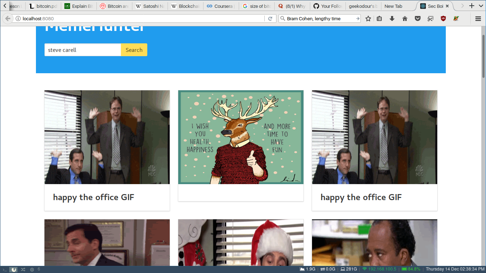

**Live API Endpoint:** http://138.197.42.109:8000/api/search/?format=json&q=car

## Note:  Live Demo
The rest API is hosted at a digital ocean server, to access the frontend go to `./frontend/build` and open index.html

Due to memory limitations on server, a dictionary size has been reduced to 100K words. But the local one gives better results.

# memehunter
A meme retrieval engine - rest api built with django, DRF
Frontend with react and redux, hosted on netlify.

See [`./requirements.txt`](https://github.com/geekodour/memehunter/blob/master/requirements.txt) for all dependencies.



# Stack Used
 - Django 2.0
 - Django Rest Framework
 - MongoDB, Sqlite3
 - BS4, requests
 - tesseract
 - gensim,numpy,nltk
 - HTML,CSS,JavaScript,React&Redux

# Quick start
- Download the GoogleNews Word2Vec Slim from [here](https://github.com/eyaler/word2vec-slim), extract and put it by this `./README.md` in the root directory.
- User should also have tesseract installed

Create a virtualenv and install the dependencies using `pip install -r requirements.txt`

Create a environment variable using `export DJANGO_SETTINGS_MODULE=config.settings.local`

Now run the following:
```
$ ./manage.py makemigrations
$ ./manage.py migrate
$ ./manage.py fetchinitialmemes
$ ./manage.py indexdbfields
$ ./manage.py runserver
```
> the `fetchinitialmemes` command **will take a while** because It will be fetching the memes from the sources.

To access the api after running runserver:
- All memes endpoint: http://localhost:8000/api/memes/
- Single memes endpoint: http://localhost:8000/api/memes/MEME_ID
- Search memes endpoint: http://localhost:8000/api/search/?q=office

# The Idea
Memes are fetched from various sources(currently **reddit** and **giphy** but other sources like **facebook/instagram** can be added easily)
the fetching part lives in `./memes/tasks/fetchmemes.py`.
All the fetching classes inherit from the base fetching class `BaseMemeFetcher` in `./memes/tasks/fetchmemes.py`

*pytesseract* is used to extract words from the images and the extracted text is put into `extracted_text` which is further used in full text search.

#### Django admin commands
- **fetchinitialmemes**: These`(./memes/tasks/fetchmemes.py)` fetch instances are called by a custom django admin command called **fetchinitialmemes** which lives in `./memes/management/commands/fetchinitialmemes.py`.User can specify how many memes should be fetched initially from each source.  These fetch instances were designed so that they can be ran after a specific period of iterval using celery (not implemented because of time constraints) So fetch and process 1000 memes initially and store processed information in the database. That's what **fetchinitialmemes** does. Also, I added a additional function to fetch **the office** memes separetly.
- **indexdbfields**: This django admin command indexes the mongoDB for Text and KeyWord Searches

### Databases
Since Django does not have good support for nosql databases and I had to use mongoDB for this for fast inverted Indexing of documents,
I had to use both sqlite3 and mongoDB for this task. I added custom manager methods to access the mongoDB database
from the `memes.models.Meme` django model. They can be found under `./memes/managers.py`

A random mongoDB document:
```json
{ "_id" : ObjectId("5a3087fc0d50537617c74fed"),
  "url" : "https://i.giphy.com/media/4cuyucPeVWbNS/giphy_s.gif",
  "title" : "the office dislike GIF",
  "tags" : [ "mrw", "the office", "reddit", "october", "wife", "michael scott", "dislike", "brotherinlaw", "nope dont like that" ],
  "source" : "giphy",
  "description" : "",
  "extracted_text" : "Nope. Don’t Ijke that."
}
```

### Meme Retrival Process
There is only one enpoint for the search and it takes only a query parameter named `q`, so user needs to pass the query to `q`

Example: `http://localhost:8000/api/search/?q=happy,memes`

So let's look at how this query is processed:
**./memes/views.py**
```python
class MemeSearch(APIView):
    def get(self, request, format=None):
        query = self.request.query_params.get('q',None)
        queryTokens = query.split(',')
        queryTokens2 = tokenize(query)
        l1 = list(Meme.objects.text_search_meme(query))
        l2 = list(Meme.objects.tag_search_meme(queryTokens))
        l3 = list(Meme.objects.tag_search_meme_w2v(queryTokens2))
        l = MemeSerializer(l1+l2+l3, many=True)
        return Response(l.data)
```
Here I am adding up 3 separate queries(`l1,l2,l3`) that are made to the mongoDB collection `meme`
Because, I enabled full text search on `extracted_text` and `title` and normal indexing on `tags`.
- **l1** is about getting the relevant results from full text search using **mongoDB**
- **l2** is about getting the relevant results by matching direct keywords to tags
- **l3** uses nltk to extract word tokens from the query, and find the nearest `tags` in mongoDB using word2vec implemented
  using the [GoogleNews Word2Vec Slim](https://github.com/eyaler/word2vec-slim) pretrained vectors and *gensim*,
  and return results having those tags. The threshold is 0.001.

## Improvements to be done
- Remove Duplicates from `l1+l2+l3`
- Celery integration for fetching and processing images
- Extract tokens from `extracted_text`
